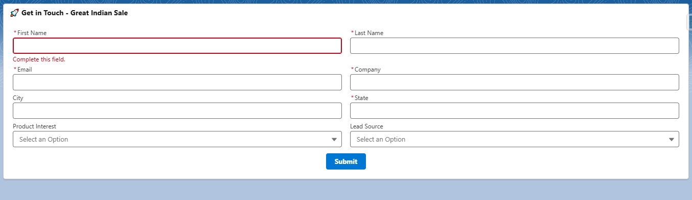

# 🌐 Web To Lead Form - LWC 💼

Welcome to the **Web-To-Lead Form** project! This project utilizes **Salesforce Lightning Web Components (LWC)** to create a user-friendly, dynamic lead capture form. The form integrates seamlessly with Salesforce, capturing lead data and automatically managing leads through campaigns, as well as assigning leads based on state. This form is designed to enhance the efficiency of lead management processes within Salesforce.

---

## 🚀 Features
- 🌟 **Dynamic Form Fields**: Collect lead details such as name, email, company, phone number, and other custom fields.
- 🔄 **Real-Time Data Submission**: Automatically submits lead data to Salesforce when the form is filled out.
- 📊 **Seamless Salesforce Integration**: Integrates directly with Salesforce to create, store, and manage leads.
- 🖥️ **Responsive Design**: Optimized for both desktop and mobile views.
- 💡 **Customizable Styling**: Use included CSS to adjust the form's appearance.
- 📢 **Automatically Add Campaign Members**: Each lead created via the form is automatically added to a specified campaign.
- 🌍 **Assign Leads Based on State**: Leads are assigned to the appropriate Salesforce user based on their location. For example, leads from specific states like Maharashtra, Goa, etc., will be assigned to **Kislay Kumar**, while leads from other states will be assigned to **Sale Manager**.

---

## 🔧 Installation

### Prerequisites

Before starting, make sure you have the following installed:

- [Salesforce DX](https://developer.salesforce.com/tools/sfdxcli)
- [Visual Studio Code](https://code.visualstudio.com/) with Salesforce Extensions

### Steps to Install

1. **Clone the repository**:
   ```bash
   git clone https://github.com/KislayKashyap-hub/Web-To-Lead-Form-LWC.git
   ```

2. **Navigate to your project directory**:
   ```bash
   cd Web-To-Lead-Form-LWC
   ```

3. **Deploy the Lightning Web Component** to your Salesforce org:
   ```bash
   sfdx force:source:push
   ```

4. **Open Salesforce** and add the Web-To-Lead form component to a Lightning page.

---

## 🖼️ Screenshots

### Desktop View:




---

## 💡 Usage

Once the form is deployed and added to your Salesforce Lightning page:

1. **Fill out the form**: The lead's details such as name, email, company, and phone number are entered.
2. **Submit the form**: The lead data is automatically captured upon submission and a new lead record is created in Salesforce.
3. **Automatic Lead Assignment**: Based on the state provided in the form, the lead will be assigned to the appropriate Salesforce user. 
For instance, leads from Maharashtra, Goa, Gujarat, and other states will be assigned to **Kislay Kumar**, while others will be assigned to **Sale Manager**.
4. **Campaign Membership**: The lead is also automatically added to a predefined campaign in Salesforce.
5. **Real-Time Confirmation**: Upon successful submission, the user receives a success message; otherwise, an error message is shown.
5. **Re-Direct to Created Lead**: Automatically, the lead will redirect to the Lead Record Page.
---

## 🛠️ Technologies Used

- **Salesforce Lightning Web Components (LWC)** ⚡
- **Apex Classes** 💻
- **Salesforce DX** 🔧
- **CSS Styling** 🖌️

---

## 📑 Documentation

This project consists of several key components that work together to collect lead information and ensure it is processed correctly in Salesforce.

### 1. **LWC - WebToLeadForm**
   - **Location**: `force-app/main/default/lwc/webToLeadForm/`
   - **Description**: The main Lightning Web Component that renders the lead form and handles data submission.
   - **Core Features**:
     - Dynamically renders the input fields.
     - Handles form submission and displays success or error messages.
     - Interacts with Apex classes to create a new lead record in Salesforce.
     - Integrates with the campaign and assignment logic for lead management.

### 2. **Apex Controller - WebToLeadController.cls**
   - **Location**: `force-app/main/default/classes/WebToLeadController.cls`
   - **Description**: This Apex class is responsible for the business logic of the form, such as creating a new lead record, assigning the lead owner based on the state, and adding the lead to a campaign.
   - **Core Features**:
     - **Lead Creation**: Receives form data and creates a lead record in Salesforce.
     - **State-Based Assignment**: Determines the lead owner based on the state and assigns the lead to that user.
     - **Campaign Integration**: Automatically adds the new lead to a specified campaign.
     - **Error Handling**: Handles any errors that may arise during the lead creation process and sends appropriate feedback to the LWC.

### 3. **Apex Test Class - WebToLeadControllerTest.cls**
   - **Location**: `force-app/main/default/classes/WebToLeadControllerTest.cls`
   - **Description**: The test class to ensure that the logic in the `WebToLeadController.cls` works as expected.
   - **Core Features**:
     - Contains unit tests for lead creation, state-based assignment, and campaign membership.
     - Ensures that all Apex functionality is covered and behaves as expected.

### 4. **CSS Styling - webToLeadForm.css**
   - **Location**: `force-app/main/default/lwc/webToLeadForm/webToLeadForm.css`
   - **Description**: Contains custom styles to make the form visually appealing and responsive.
   - **Core Features**:
     - Custom styles for buttons, form inputs, and layout.
     - Responsive design adjustments for both desktop and mobile views.
     - Clean and modern design to enhance the user experience.

---

## 🧑‍💻 Contribution

We encourage contributions! If you'd like to improve the project, follow these steps:

1. **Fork the repository** to your GitHub account.
2. **Create a new branch** for your feature or fix (`git checkout -b feature-branch`).
3. **Make your changes**.
4. **Commit your changes** with a meaningful message (`git commit -m 'Add feature'`).
5. **Push to the branch** (`git push origin feature-branch`).
6. **Open a pull request** to merge your changes.

---

## 📈 License

This project is licensed under the MIT License - see the [LICENSE](LICENSE) file for details.

---

## 📞 Contact

If you have any questions or need further assistance, feel free to contact me:

- **Email**: [kislay.tech@gmail.com](mailto:kislay.tech@gmail.com)
- **LinkedIn**: [Kislay Kumar](https://www.linkedin.com/in/kislay-kumar-kk/)

---
